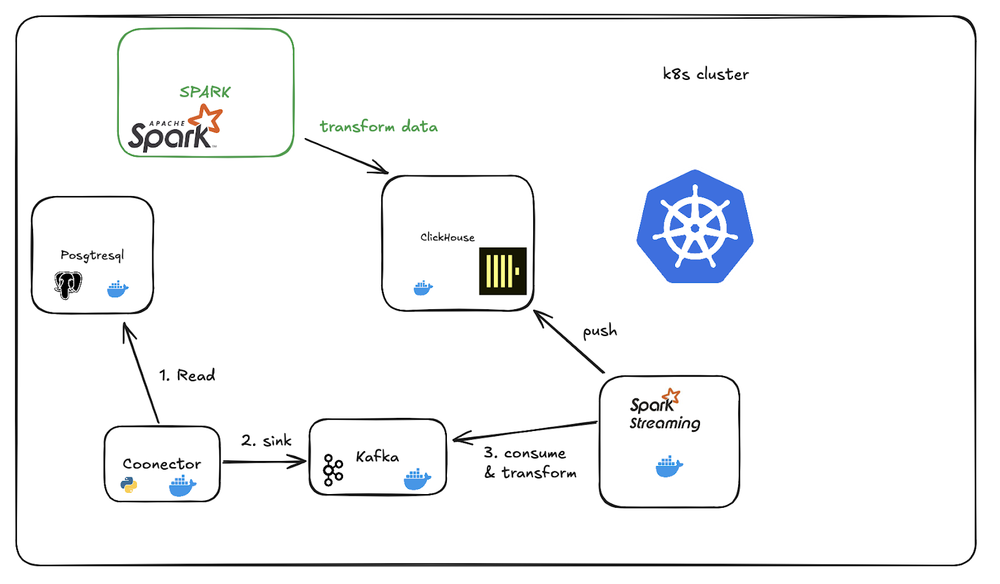
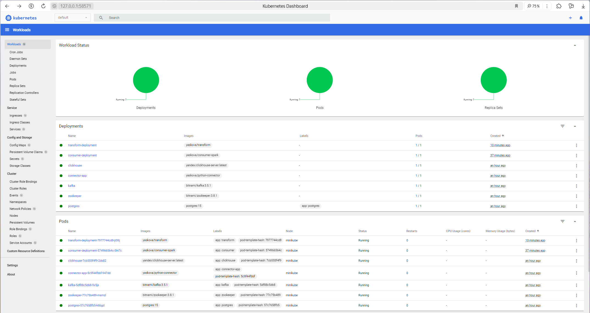
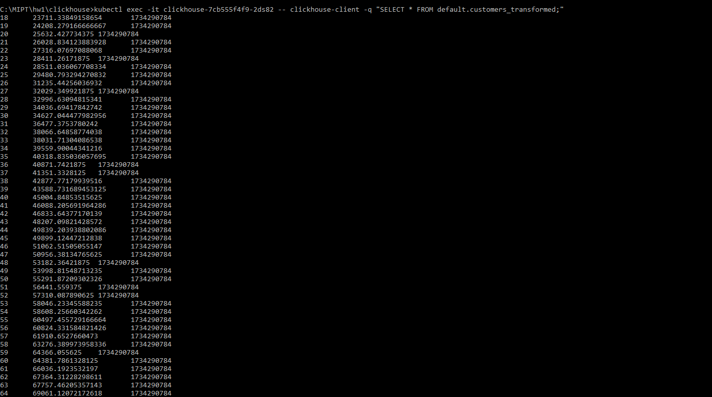

# Домашнее задание №1

## Задача
Разработать Spark-приложение, которое:

* Рассчитывает средний доход (Income) для каждого возраста.
* Сохраняет результаты в таблицу customers_transformed.
* Настраивает подключение Spark-приложения к существующей инфраструктуре.

## Архитектура кластера

Кластер представляет собой ETL-пайплайн, который выполняет следующие задачи:
1. Извлекает данные из PostgreSql с использованием Python Connector.
2. Загружает эти данные в Kafka.
3. Трансформирует их с помощью Apache Spark Streaming.
4. Сохраняет обработанные данные в ClickHouse для дальнейшего аналитического использования.
5. Данные из ClickHouse обрабатываются с помощью разработанного Spark-приложения.
6. Полученные результаты сохраняются в таблицу customers_transformed ClickHouse.

Для развертывания приложения используются Docker и Kubernetes.

## Запущенный кластер в Kubernetes Dashboard

## Трансформированная таблица customers_transformed

