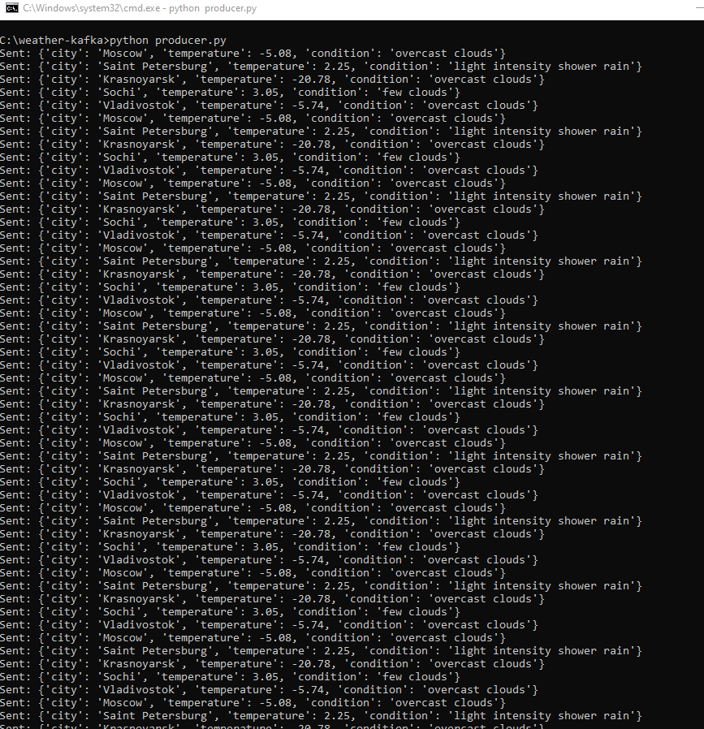
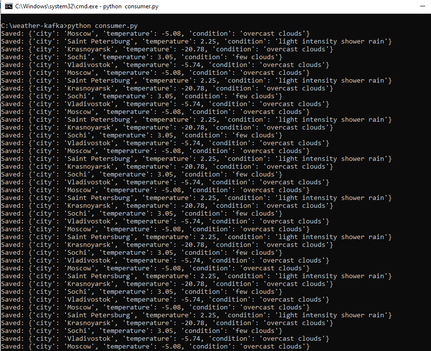
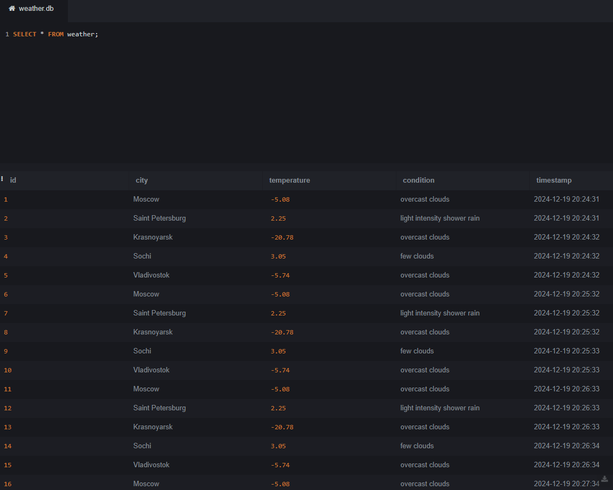

# Проект: Система обработки данных о погоде с использованием Apache Kafka
#### Содержание
1. [Структура проекта](#1-структура-проекта)
2. [Структура базы данных](#2-структура-базы-данных)
3. [Запуск](#3-запуск)
4. [Результаты работы сервиса](#4-результаты-работы-сервиса)


## 1. Структура проекта
```
C:\weather-kafka
├── producer.py       # Отправка данных в Kafka
├── consumer.py       # Обработка данных из Kafka
├── export_to_json.py # Экспорт данных в JSON
├── weather.db        # SQLite база данных
├── requirements.txt  # Зависимости Python
```

## 2. Структура базы данных

### Таблица `weather`
| Поле        	| Тип       | Описание                        |
|---------------|-----------|---------------------------------|
| `id`        	| INTEGER   | Уникальный идентификатор записи |
| `city`      	| TEXT      | Название города                 |
| `temperature` | REAL    	| Температура                     |
| `condition` 	| TEXT      | Описание погоды                 |
| `timestamp` 	| DATETIME  | Время сохранения записи         |

Пример содержимого таблицы:
| id | city          	| temperature | condition       			| timestamp           |
|----|------------------|-------------|-----------------------------|---------------------|
| 1  | Moscow        	| -5.08       | overcast clouds      		| 2024-12-19 20:24:31 |
| 2  | Saint Petersburg | 2.25     	  | light intensity shower rain | 2024-12-19 20:24:31 |


## 3. Запуск

### Запуск Zookeeper и Kafka

#### Запуск Zookeeper
1. Откройте командную строку.
2. Перейдите в папку `C:\kafka\bin\windows`.
3. Выполните команду:
   ```
   .\zookeeper-server-start.bat ..\..\config\zookeeper.properties
   ```

#### Запуск Kafka-сервера
1. В новом окне командной строки перейдите в ту же папку `C:\kafka\bin\windows`.
2. Выполните команду:
   ```
   .\kafka-server-start.bat ..\..\config\server.properties
   ```

#### Создание топика
1. В той же папке выполните команду для создания топика `weather` с 3 разделами:
   ```
   .\kafka-topics.bat --create --topic weather --bootstrap-server localhost:9092 --partitions 3
   ```

#### Запуск сервиса

1. Убедитесь, что Kafka и Zookeeper запущены.
2. Установите зависимости из файла `requirements.txt`:
   ```
   pip install -r requirements.txt
   ```
3. В файле producer.py укажите свой API-ключ от сервиса OpenWeatherMap:
   ```
   API_KEY = "ВАШ_API_КЛЮЧ_ОТ_OPENWEATHERMAP"
   ```
4. Запустите продюсера:
   ```
   python producer.py
   ```
   Этот файл будет отправлять данные о погоде каждые 60 секунд.
5. В отдельном терминале запустите потребителя:
   ```
   python consumer.py
   ```
   Этот файл будет сохранять данные в базу SQLite.
6. Для экспорта данных в JSON выполните:
   ```
   python export_to_json.py
   ```

## 4. Результаты работы сервиса

### Producer
После запуска работал некоторое время и каждые 60 секунд получал данные с OpenWeatherMap и направлял их в Kafka:

### Consumer
Получал сообщения и добавлял их в базу данных

### Содержимое таблицы weather в базе данных

### Выгрузка содержимого таблицы weather из базы данных в json
Выполнена с помощью скрипта [export_to_json.py](./export_to_json.py).
Данные сохранены в файл [weather_data.json](./weather_data.json)
